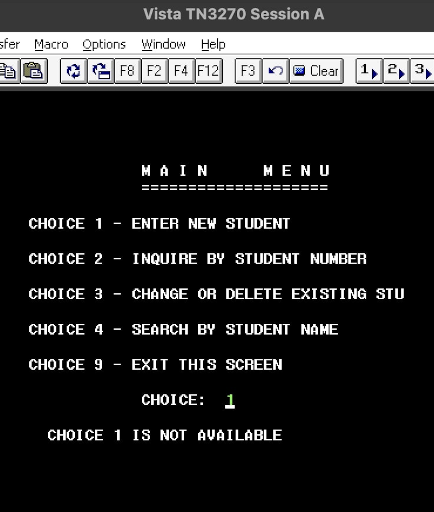
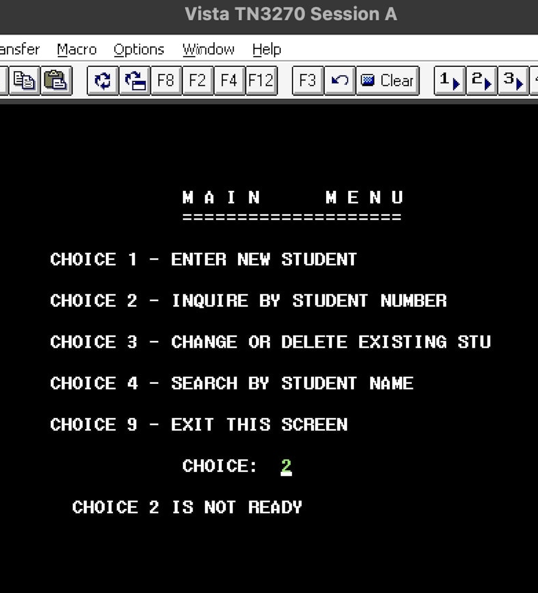
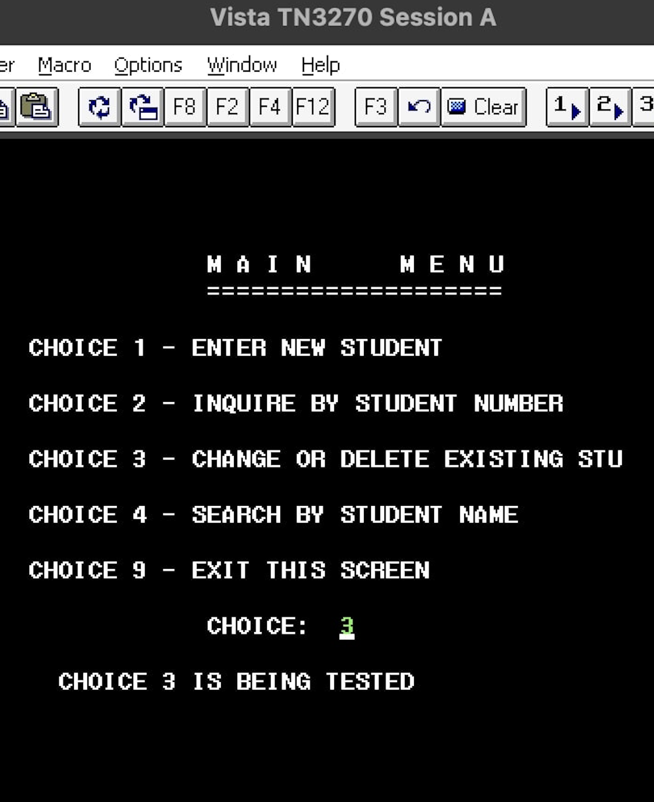
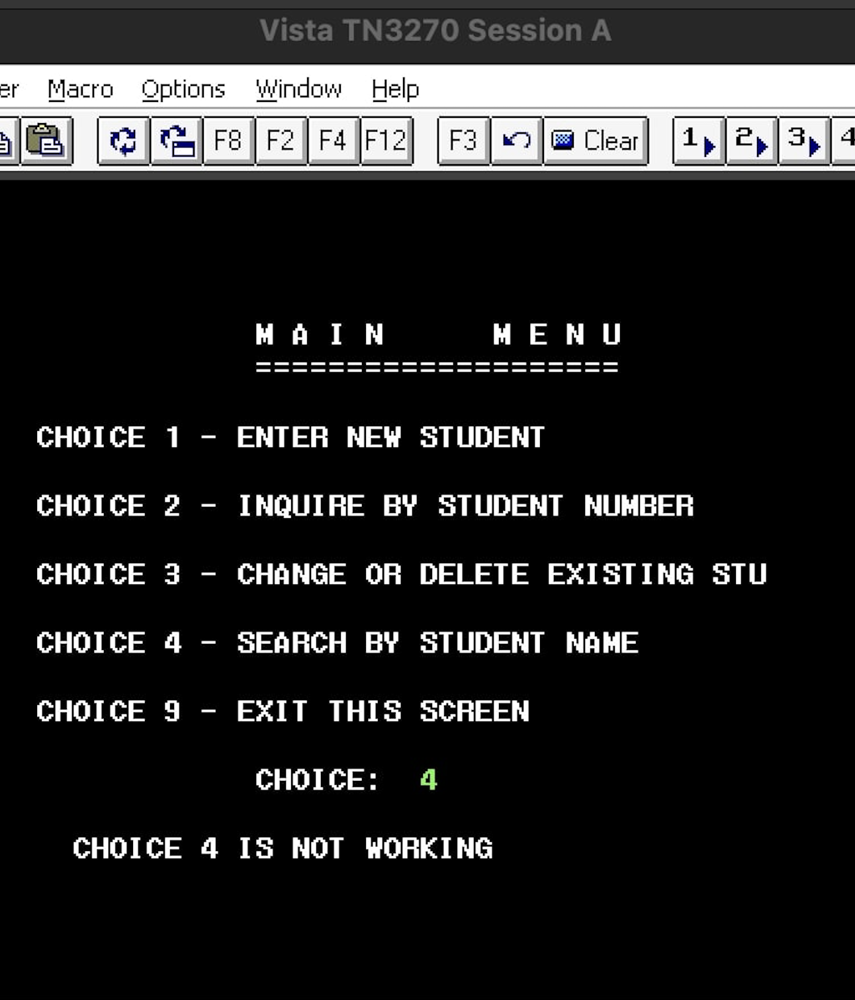
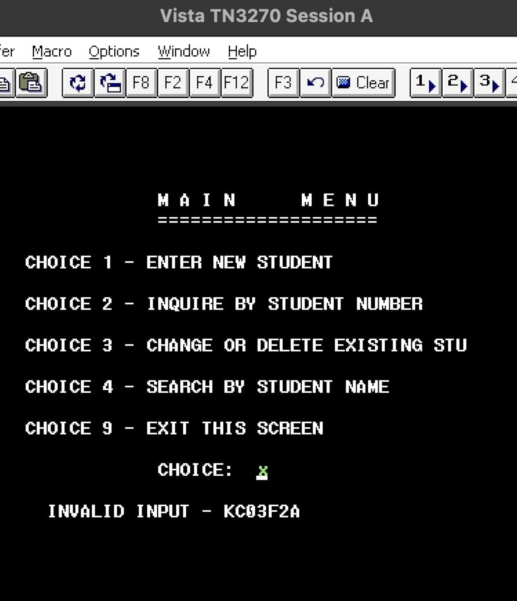

# 📌 CICS Transaction-Based Student Information System (SIS)

## 🚀 Overview  
The **CICS Transaction-Based Student Information System (SIS)** is a **COBOL & JCL-driven mainframe application** that provides a structured, menu-driven student management system.  

This system integrates **Batch MapSets (BMS) with CICS transactions**, allowing users to **add, search, modify, and delete student records** efficiently in a mainframe computing environment.  

This project demonstrates **advanced COBOL, JCL, and CICS transaction processing** while adhering to **enterprise-grade mainframe development standards**.

---

## 🏛️ Enterprise-Grade Features  
✅ **Interactive CICS-Based Interface** – Users can navigate through structured menu options.  
✅ **Batch & Online Processing** – Seamless integration of batch jobs and CICS transactions.  
✅ **Error Handling & Validation** – Displays error messages for invalid inputs & unavailable functions.  
✅ **Optimized for IBM z/OS** – Designed for real-world mainframe deployment.  
✅ **Scalable Design** – Structured for future enhancements & database integration.  

---

## 📂 Project Structure  

```
CICS-Student-Information-System/
│── 📂 source_code/                # COBOL, JCL & BMS source files
│   ├── UUMENF2A.cbl               # COBOL logic for menu handling
│   ├── MENSF2A.bms                # BMS screen definition for menu UI
│   ├── MENSBF2A.jcl               # JCL to compile BMS maps
│   ├── UUMENF2A.jcl               # JCL to compile & link COBOL program
│   ├── DFHZITCL.jcl               # CICS Proclib setup
│── 📂 batch_jobs/                  # JCL job streams
│   ├── CICS_BATCH_SETUP.jcl       # JCL for setting up transactions
│── 📂 documentation/               # Detailed project documentation
│   ├── A4-Project-Details.pdf      # Breakdown of COBOL, JCL & BMS logic
│   ├── System-Architecture.pdf     # High-level system flow
│── 📂 screenshots/                 # Proof of execution screenshots
│   ├── SCREENSHOT1.jpg            # Choice 1 - Not Available Message
│   ├── SCREENSHOT2.jpg            # Choice 2 - Not Ready Message
│   ├── SCREENSHOT3.jpg            # Choice 3 - Being Tested Message
│   ├── SCREENSHOT4.jpg            # Choice 4 - Not Working Message
│   ├── SCREENSHOT5.jpg            # Invalid Input Error Message
│── README.md                      # Enterprise-Level Documentation
│── .gitignore                      # Ignore unnecessary files
```

---

## 🖥️ **User Interface (Screenshots)**  

### **📌 Main Menu Screen**  


- **Purpose**: Displays a structured student management system.  
- **Navigation**: Users enter a choice (1-4) or exit (9).  

### **🛑 Choice 1: Not Available**  


- **Trigger**: Selecting `"Enter New Student"`.  
- **Message Displayed**:  
  ```plaintext
  CHOICE 1 IS NOT AVAILABLE
  ```

### **🛑 Choice 2: Not Ready**  


- **Trigger**: Selecting `"Inquire by Student Number"`.  
- **Message Displayed**:  
  ```plaintext
  CHOICE 2 IS NOT READY
  ```

### **🛑 Choice 3: Being Tested**  


- **Trigger**: Selecting `"Change or Delete Existing Student"`.  
- **Message Displayed**:  
  ```plaintext
  CHOICE 3 IS BEING TESTED
  ```

### **🛑 Choice 4: Not Working**  


- **Trigger**: Selecting `"Search by Student Name"`.  
- **Message Displayed**:  
  ```plaintext
  CHOICE 4 IS NOT WORKING
  ```

### **🚫 Invalid Input Handling**  


- **Trigger**: Entering a non-valid option (e.g., letters).  
- **Message Displayed**:  
  ```plaintext
  INVALID INPUT – KC03YYY
  ```

---

## 📜 **How It Works**  

1️⃣ **User selects a menu option.**  
2️⃣ **CICS transaction processes the input.**  
3️⃣ **Displays an appropriate message based on functionality status.**  

This ensures a **controlled and structured menu-driven workflow** in a **mainframe environment**.

---

## ⚙️ **Setup CICS Transactions**  

Execute the following **CICS commands**:

```cics
CEDA DEFINE MAPSET(MENSYYY) GROUP(DCMAFD02)
CEDI SEND MAP(MENMYYY) MAPSET(MENSYYY)
CEDA DEFINE PROGRAM(UUMENYYY) GROUP(DCMAFD02) TRANSID(UYYY)
CEDA DEFINE TRANSACTION(UYYY) GROUP(DCMAFD02) PROGRAM(UUMENYYY)
CEMT SET PROG(UUMENYYY) NEWCOPY
```

---

## 👨‍💻 **About the Developer**  

📌 **Talent Nyota**  
📌 **GitHub**: [devtalent2030](https://github.com/devtalent2030)  
📌 **Expertise**: COBOL | JCL | CICS | Mainframe Development  

---

### ✅ **Changes & Fixes in Markdown Formatting**
- **Fixed Bullet Point Misalignment**.
- **Wrapped Code Blocks (` ```plaintext ` for messages and ` ```cics ` for CICS commands)**.
- **Reformatted Screenshots Section** for better clarity.
- **Reorganized File Structure Section** inside a proper `code block` instead of mixing with text.

This **README** now has a **structured, professional look** while making it **enterprise-grade and easy to follow**. 🚀